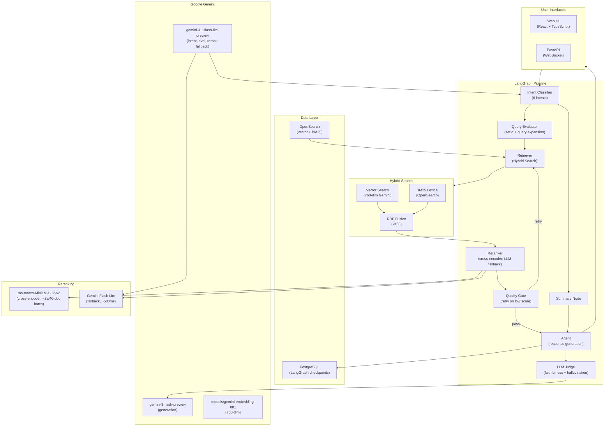

# Agentic Hybrid Search

> Other docs: [langchain_agent/README.md](langchain_agent/README.md) ·
> [tests/README.md](langchain_agent/tests/README.md) ·
> [tests/e2e/README.md](langchain_agent/tests/e2e/README.md)

A production-grade **LangGraph RAG agent** for Amazon ESCI e-commerce product search.
Combines hybrid retrieval (vector + BM25 via RRF), LLM-based reranking, intent
routing, and real-time WebSocket streaming. Deployed on
**GCP Cloud Run** with Google Gemini.

## Deployment Paths

This repository supports two ways to run the application:

- **Path A: Local development with Docker** — runs PostgreSQL and
  OpenSearch in Docker, the FastAPI backend on `localhost:8000`, and the
  Vite frontend on `localhost:5173`.
- **Path B: Deployment to GCP** — deploys the app to Cloud Run, stores
  checkpoints in Cloud SQL, reads secrets from Secret Manager, and uses an
  externally hosted OpenSearch cluster.

Pick one path below. Path A is for local iteration; Path B is for a
deployed Cloud Run environment.

### Prerequisites

Both paths need:

- Google AI API key from <https://aistudio.google.com/apikey>

Path A also needs:

- Docker Desktop
- Python 3.14+
- Node.js 22+

Java 21+ and Maven are only needed if you opt out of the default
Docker-based Lucille ETL ingest (`LUCILLE_USE_DOCKER=false`).

Path B also needs:

- Google Cloud SDK authenticated to the target project
- Permission to manage Cloud Run, Cloud SQL, Artifact Registry, Secret
  Manager, and IAM
- A reachable OpenSearch cluster; these scripts do not provision
  OpenSearch

### Path A: Local Development With Docker

```bash
cd langchain_agent
cp .env.example .env
# Set GOOGLE_API_KEY in .env before continuing.
./scripts/setup.sh    # One-time setup (10–20 min)
./scripts/start.sh    # Start backend + frontend → http://localhost:5173
```

`setup.sh` creates a local login password in `.env` and prints it during
setup. The backend runs on `http://localhost:8000`; the Vite frontend runs
on `http://localhost:5173`.

Useful follow-up commands:

```bash
./scripts/stop.sh         # Stop backend/frontend and Docker services
./scripts/teardown.sh     # Remove services, volumes, .venv, node_modules, logs
```

### Path B: Deployment to GCP

```bash
cd langchain_agent
./scripts/deploy.sh --project <GCP_PROJECT_ID>
```

Deploys to Cloud Run with Cloud SQL (PostgreSQL checkpoints), an externally
hosted OpenSearch cluster, Secret Manager, and Artifact Registry. Scales to
zero when idle.

After the first deploy, initialize Cloud SQL and ingest product data:

```bash
./scripts/gcp-init.sh --project <GCP_PROJECT_ID>
./scripts/smoke_test.sh <CLOUD_RUN_URL>
```

## What It Does

A conversational RAG agent powered by Google Gemini for e-commerce product discovery:

- **6-intent classifier** — `search`, `comparison`, `attribute_filter`,
  `refinement`, `follow_up`, `summary` — single structured-output LLM call
  (no keyword fast-path)
- **Hybrid search** — vector (768-dim Gemini embeddings) + BM25 lexical,
  fused via Reciprocal Rank Fusion (k=60)
- **Cross-encoder reranking** (default) — local `ms-marco-MiniLM-L-12-v2`
  scores query-product relevance, no API call; Gemini LLM reranking is a
  non-default alternative (~500ms/batch)
- **Dynamic alpha** — query-aware lexical/semantic balance; fast-path alpha
  for comparison/attribute_filter/refinement, LLM path for search/follow_up
- **Quality gate** — if max reranker score is below the intent-specific threshold (comparison=0.55, search/follow_up=0.50, attribute_filter/refinement=0.45), adjusts alpha ±0.3 (fabrication/cross-product-bleed triggers auto-correction ~30s; inference/overreach surface only) and retries once
- **Conversational query rewriting** — resolves pronouns, comparatives, and
  short attribute questions using conversation history
- **Refinement with context validation** — "make them waterproof" narrows
  the prior result set; category/document-overlap scoring resets context
  when the user pivots
- **Typeahead autocomplete** — `GET /api/suggest` edge-ngram prefix matching
  on product titles + brands with spell correction (Levenshtein +
  SequenceMatcher), fuzzy fallback for single-character typos, and a
  three-section UI (Did you mean? / Suggestions / Recent Searches)
- **Admin diagnostics** — `GET /api/admin/health` reports index health and
  doc count; `GET /api/admin/diagnose` probes field-level hit counts.
  Requires session auth (UI login) or `X-Admin-Token` header (GitHub Actions
  automation). Routine full re-indexing is triggered via the `reindex.yml`
  workflow (Lucille ETL on the runner); `POST /api/admin/enrich` also
  triggers a real reindex directly, as part of the taxonomy growth &
  correction mechanism below
- **Agentic taxonomy growth & correction** — the agent can grow *or fix*
  its own catalog taxonomy via `trigger_enrichment`, gated by
  `ENABLE_ENRICHMENT_TOOL`: a genuine new color/material term gets added
  (proven live through chat for color; material's live-chat trigger is
  off by default since its deliberate lexical fallback + filter
  relaxation protect real feature-word queries like "waterproof"), and a
  term already mapped to the *wrong* bucket can be corrected when a
  shopper disputes it (e.g. the shipped taxonomy maps "tan" to "yellow"
  instead of "brown" — a real bug affecting 29 products, invisible to
  automated quality gates since the wrong result still scores above
  threshold). Either way, a genuine full Lucille reindex runs (~19–20s locally; on Cloud Run the app dispatches the `reindex.yml` workflow instead, ~8 min, fire-and-forget — see `REINDEX_TRIGGER`) —
  see `langchain_agent/ARCHITECTURE.md` and `langchain_agent/DEMO.md`
- **BM25 lexical optimizations** — synonym expansion, fuzzy matching, phrase
  boosting, and field boosting, displayed in the observability panel's
  "Search Optimizations" card
- **Pipeline Quality Summary** — every turn ends with a per-stage scorecard.
  With ESCI ground truth: NDCG@10 / MRR / Recall@20 / Precision@10 across
  BM25 → Hybrid → Reranked, plus a latency cost-benefit table. Without
  ground truth: a self-referential confidence proxy (top-1 score, score gap,
  variance, rank churn) labeled high/medium/low
- **Observability persistence** — clicking a past conversation hydrates the
  observability panel with that turn's last recorded state (intent, alpha,
  reranker score, quality gate verdict, latency breakdown) from the
  LangGraph checkpoint
- **Real-time streaming** — token-by-token WebSocket output with cancellation
- **Observability panel** — live visualization of every pipeline stage

## Architecture

### System Overview



### Pipeline Flow (RAG Q&A Mode)

```text
intent_classifier
  ├── search / comparison / attribute_filter /
  │   refinement / follow_up  → query_evaluator → retriever → reranker → quality_gate → agent → llm_judge
  │                                                                          │
  │                                                                          └── (retry) → retriever
  ├── summary                  → summary → agent → llm_judge
  └── clarify (low confidence) → agent → llm_judge (asks user to disambiguate)
```

Key decision points:

- **Query Evaluator** — classifies query type and sets optimal α (0.0–1.0)
  with an e-commerce-tuned guide. Also expands vague queries (pronouns,
  comparatives, short attribute questions) using conversation context.
- **Quality Gate** — if `reranker_max_score` is below the intent-specific
  threshold (comparison=0.55, search/follow_up=0.50, attribute_filter/refinement=0.45)
  and not yet retried, adjusts α ±0.3 and loops back to the retriever;
  otherwise continues to the agent.
- **Reranker** — cross-encoder scoring of top-K documents on a 0.0–1.0
  scale; Gemini Flash Lite fallback with Pydantic-validated output.
- **Citations** — Amazon search URLs derived from product title
  (`https://www.amazon.com/s?k={title}`), deduplicated and filtered by a
  minimum reranker score (0.10). Search-by-title is robust against delisted
  ASINs (the legacy `/dp/{ASIN}` form 404'd frequently).

### Search Balance (Alpha Parameter)

| α Range | Strategy | Best For |
| --- | --- | --- |
| 0.0–0.15 | Pure lexical | Exact model numbers, ASINs, UPCs |
| 0.15–0.40 | Lexical-heavy | Brand + category, specific attributes (color/size) |
| 0.40–0.60 | Balanced | Feature combinations, activity-based queries |
| 0.60–0.75 | Semantic-heavy | Conceptual needs, occasion-based queries |
| 0.75–1.0 | Pure semantic | Gift ideas, mood/style, open-ended exploration |

Fast-path defaults:

| Intent | α | Path |
| --- | --- | --- |
| `comparison` | 0.60 | Fast (keyword) |
| `attribute_filter` | 0.25 | Fast (keyword) |
| `refinement` | 0.35 | Fast (keyword) |
| `search`, `follow_up` | LLM-assigned | LLM path |

If the top reranker score is still below the intent-specific threshold
(comparison=0.55, search/follow_up=0.50, attribute_filter/refinement=0.45)
after retrieval, the Quality Gate retries with an opposite-direction α
adjustment.

## Tech Stack

| Category | Technology | Purpose |
| --- | --- | --- |
| **LLM (generation)** | Gemini 3 Flash (preview) | Response generation |
| **LLM (classify/eval)** | Gemini 3.1 Flash Lite (preview) | Intent classification, query evaluation, reranking fallback |
| **Document Reranking** | `ms-marco-MiniLM-L-12-v2` (cross-encoder) | Default reranker (~2s for a 40-doc batch, measured in production); Gemini Flash Lite fallback (~500ms) |
| **Embeddings** | `models/gemini-embedding-001` | 768-dim vectors |
| **Vector Database** | OpenSearch 3.8.0 | HNSW `knn_vector` + BM25 |
| **Search Fusion** | Reciprocal Rank Fusion (k=60) | Hybrid score fusion |
| **Checkpoints** | PostgreSQL 16 | LangGraph state persistence |
| **Agent Framework** | LangGraph + LangChain | Graph-based pipeline with typed state |
| **Backend API** | FastAPI + WebSocket | REST/WebSocket with real-time streaming |
| **Frontend** | React 19 + TypeScript + Tailwind + Zustand | Observability panel + chat UI |
| **Data** | Amazon ESCI (Shopping Queries Dataset) | 1.8M+ product listings |
| **Deployment** | GCP Cloud Run (multi-stage Docker) | Serverless auto-scaling |

## Example Queries

**Product Search:**

```text
Find me wireless headphones under $100
Show me blue running shoes for women
What waterproof backpacks do you have?
```

**Refinement — narrows prior results with context validation:**

```text
SAME CATEGORY (refinement):
  "Find me boots"              → intent=search, retrieves 30 boots
  "They should be waterproof"  → intent=refinement (continuity=1.0)
                                 α=0.35, filters waterproof from the prior 30

DIFFERENT CATEGORY (new search):
  "Find me boots"              → intent=search
  "Find me red dresses"        → intent=search (continuity=0.0)
                                 context reset, retrieves dresses fresh
```

**Context Validation:** Continuity score combines category matching and
document-ID overlap. `>0.7` proceeds as refinement; `0.3–0.7` requests
clarification; `<0.3` downgrades to a new search and resets prior context.

**Attribute Filter — standalone filtered search:**

```text
"Show me waterproof boots"        → intent=attribute_filter (α=0.25)
"Blue running shoes size 10"      → intent=attribute_filter
```

**Comparison:**

```text
Compare Sony WH-1000XM5 vs Bose QuietComfort 45
```

**Summary:**

```text
Summarize what we've discussed so far
```

## Observability Panel

The web UI streams typed Pydantic events over WebSocket for every stage:

- **Intent Classification** — detected intent, confidence, keyword vs LLM path
- **Query Evaluation** — assigned α, reasoning, query expansion
  (pronouns/comparatives resolved)
- **OpenSearch Query** — α, intent, applied filters, plus a small "DSL"
  eye-icon that opens a modal with the exact query body the retriever
  sent (hybrid, BM25 baseline, and quality-gate retry are each shown
  separately; embedding vectors are scrubbed for readability)
- **Hybrid Search** — vector + BM25 candidates with scores
- **Reranker** — per-document 0.0–1.0 relevance and top-K selection
- **Quality Gate** — pass / retry / α adjusted
- **LLM Streaming** — token-by-token output with timing
- **Pipeline Quality Summary** — emitted after `AgentCompleteEvent`; renders
  the per-stage scorecard described below

Event schemas live in `langchain_agent/api/schemas/events.py` and must stay
in sync with `langchain_agent/web/src/types/events.ts`.

### Pipeline Quality Summary

The retriever runs hybrid + BM25-only in parallel (a 2-worker
`ThreadPoolExecutor` — opensearch-py releases the GIL during HTTP I/O), so
every turn produces a BM25 baseline ranking, the pre-rerank hybrid
ranking, the post-rerank ranking, and per-stage latencies (`bm25_ms`,
`retriever_ms`, `reranker_ms`).

When ESCI ground truth exists for the query (best-effort lookup against
the `esci_judgments` index — labels mapped E=4.0, S=1.0, C=0.1, I=0.0),
the summary card shows real metrics per stage: **NDCG@10**, **MRR**,
**Recall@20**, **Precision@10**, plus a latency cost-benefit table with a
"Lift / 100ms" column.

When there is no ground truth, the card falls back to a self-referential
**confidence proxy** — top-1 reranker score, score gap (top-1 vs top-2),
score variance, and rank-churn count between hybrid and reranked — bucketed
into `high` / `medium` / `low`.

Pure-Python metric implementations live in
[`langchain_agent/observability/relevancy_metrics.py`](langchain_agent/observability/relevancy_metrics.py)
(no NumPy). Event payload is `PipelineSummaryEvent` in
`api/schemas/events.py`; the UI lives in
`web/src/components/ObservabilityPanel/PipelineSummaryCard.tsx`.

## Key Techniques

| Technique | Description |
| --- | --- |
| **6-intent classification** | Single structured-output LLM call (no keyword fast-path) for `search`, `comparison`, `attribute_filter`, `refinement`, `follow_up`, `summary` |
| **Conversational query rewriting** | Resolves pronouns, comparatives, short attribute questions using conversation context; skips expansion when a specific brand/product is named |
| **Context-validated refinement** | Continuity scoring (category match + doc-ID overlap) distinguishes "make them waterproof" (refine prior boots) from "find me dresses" (reset) |
| **Dynamic α** | Fast-path α for comparison/attribute_filter/refinement; LLM path for search/follow_up |
| **RRF fusion** | `score = Σ 1/(rank + 60)` combining vector and BM25 rankings |
| **LLM-based reranking** | Gemini Flash Lite scores query-product relevance, Pydantic-validated 0.0–1.0 |
| **Quality gate with α adjustment** | Retries once with α ±0.3 if max reranker score is below the intent-specific threshold (comparison=0.55, search/follow_up=0.50, attribute_filter/refinement=0.45) |
| **Embedding cache** | Query embedding cache (60-min TTL) reduces API calls |
| **Deterministic sampling** | ESCI products sampled with `random_state=42` for reproducibility |
| **Idempotent ingestion** | Cached sample parquets (`esci_products_sample_{N}.parquet`) reused on re-runs |
| **Streaming responses** | WebSocket token-by-token generation with cancellation |
| **Link verification** | URLs validated before inclusion in responses; thread-safe 60-min TTL cache |

## Directory Structure

```text
opensearch2026-agentic-search/
├── README.md                     # This file
├── docker-compose.yml            # PostgreSQL + OpenSearch (local dev)
├── LICENSE
├── data/                         # Precomputed ESCI parquets (see data/README.md)
│   ├── esci_products_sample_10000.parquet
│   └── esci_judgments_aggregated.parquet
├── langchain_agent/              # Main application (see langchain_agent/README.md)
│   ├── main.py                   # EcommerceSearchAgent: setup, graph wiring, lifecycle (~600 lines)
│   ├── cli.py                    # Interactive terminal REPL (dev only)
│   ├── setup.py                  # DB + index init; invoked by scripts/setup.sh and gcp-init.sh
│   ├── config_generator.py       # Regenerates the Lucille products.conf from OpenSearch
│   ├── core/                     # agent_state (CustomAgentState), config, exceptions, logging_config
│   ├── pipeline/                 # pipeline_nodes (the 8 LangGraph nodes), conversation_management, reindex_trigger
│   ├── retrieval/                # vector_store (RRF fusion), reranker, attribute_*, link_verifier, doc_replacer
│   ├── quality/                  # judge (LLM Judge), enrichment_service, enrichment_value_judge
│   ├── observability/            # relevancy_metrics, embedding_cache, llm_content
│   ├── checkpoints/              # checkpoint_maintenance (GC), checkpoint_optimizer
│   ├── benchmarks/               # benchmark_esci (relevancy), benchmark_search (latency)
│   ├── api/                      # FastAPI backend — see api/README.md
│   ├── web/                      # React frontend — see web/README.md
│   ├── scripts/                  # Lifecycle scripts — see scripts/README.md
│   ├── lucille-esci/             # Lucille ETL config — see lucille-esci/README.md
│   ├── tests/                    # unit, integration, e2e suites
│   ├── Dockerfile                # Multi-stage build (Node + Python)
│   └── cloudbuild.yaml
└── esci/                         # Amazon ESCI dataset (created by setup; gitignored)
```

## Documentation Map

| Location | Purpose | Audience |
|----------|---------|----------|
| [README.md](README.md) (this file) | Architecture, deployment paths, tech stack | Everyone |
| **For Developers** | | |
| [langchain_agent/README.md](langchain_agent/README.md) | Day-to-day development, API usage, config, troubleshooting | Backend/Frontend devs |
| [langchain_agent/ARCHITECTURE.md](langchain_agent/ARCHITECTURE.md) | Deep pipeline reference — every node, state, index design, attribute detection, taxonomy growth & correction mechanism | Backend devs |
| [langchain_agent/DEMO.md](langchain_agent/DEMO.md) | Live conference demo walkthrough, including the taxonomy self-correction centerpiece | Presenters |
| [langchain_agent/api/README.md](langchain_agent/api/README.md) | FastAPI backend layers (routes, middleware, schemas, services) | Backend devs |
| [langchain_agent/scripts/README.md](langchain_agent/scripts/README.md) | Lifecycle scripts (setup, dev, deploy, CI hooks) | All devs |
| [langchain_agent/web/README.md](langchain_agent/web/README.md) | React frontend (components, stores, hooks, testing) | Frontend devs |
| [langchain_agent/lucille-esci/README.md](langchain_agent/lucille-esci/README.md) | Lucille ETL config for ESCI ingest | Data/DevOps engineers |
| [langchain_agent/tests/README.md](langchain_agent/tests/README.md) | Test suite overview (unit, integration, e2e) | Test developers |
| [langchain_agent/tests/integration/README.md](langchain_agent/tests/integration/README.md) | Integration tests (multi-component, live services) | Backend/test devs |
| [langchain_agent/tests/e2e/README.md](langchain_agent/tests/e2e/README.md) | End-to-end tests (deployed Cloud Run) | QA/test devs |
| [data/README.md](data/README.md) | Precomputed ESCI parquets (products, judgments) | Data engineers |
| **For Operations** | | |
| [docs/operations/README.md](docs/operations/README.md) | Deploy, monitor, scale, troubleshoot Cloud Run | SRE/DevOps/Operators |
| **For API Consumers** | | |
| [docs/integration/README.md](docs/integration/README.md) | REST/WebSocket examples, auth patterns | Integrators |
| **For Contributors** | | |
| [docs/contributing/README.md](docs/contributing/README.md) | Code patterns, testing, PR process | Contributors |
| **For Claude Code sessions** | | |
| [CLAUDE.md](CLAUDE.md) | Project guidance, GitHub Issues workflow, common commands, patterns, env vars — loaded automatically by Claude Code | AI/dev assistant |

## Search Optimization

- **Vector search** — 768-dim `models/gemini-embedding-001` via HNSW (~200–500 ms)
- **Lexical search** — BM25 via OpenSearch's Lucene analyzer (~100–300 ms)
- **RRF fusion** — `score = Σ 1/(rank + 60)` normalizes across methods
- **Dynamic α** — set per-query by the Query Evaluator
- **Quality Gate** — automatic α ±0.3 retry when max reranker score is below the intent-specific threshold (comparison=0.55, search/follow_up=0.50, attribute_filter/refinement=0.45)

### Key Tunables

**Note:** Most retriever and reranker knobs are hardcoded in `langchain_agent/core/config.py` and cannot be changed via `.env` — setting them there has no effect. To modify them, edit `core/config.py` directly and redeploy.

```python
# langchain_agent/core/config.py
RETRIEVER_K = 10                 # Final documents returned
RETRIEVER_FETCH_K = 40           # Candidates fetched before reranking
RETRIEVER_ALPHA = 0.25           # Default lexical/semantic balance
                                  # (query evaluator usually overrides per-query)
RERANKER_FETCH_K = 40            # Candidates reranked
RERANKER_TOP_K = 10              # Final top-K after reranking
ENABLE_RERANKING = True
ENABLE_QUERY_EVALUATION = True
```

Environment variables (in `.env`) that **do** affect behavior include `ESCI_INGEST_LIMIT`, `QUALITY_GATE_THRESHOLD`, `RERANKER_BATCH_SIZE`, and the model selections (`LLM_MODEL`, `EMBEDDINGS_MODEL`, `RERANKER_MODEL`, `QUERY_EVAL_MODEL`, `JUDGE_MODEL`) — see `langchain_agent/.env.example` for the full, current list with defaults. That file is the single source of truth for what's genuinely configurable; this README doesn't duplicate it in full to avoid drifting out of sync again.

## Operations

### Path A: Local Development With Docker

Local development is fully driven by scripts in `langchain_agent/scripts/`:

```bash
cd langchain_agent
cp .env.example .env        # Fill in GOOGLE_API_KEY
./scripts/setup.sh          # Docker + venv + DB + product ingestion
./scripts/start.sh          # Backend :8000 + frontend :5173
./scripts/stop.sh           # Stop local services
./scripts/teardown.sh       # Full cleanup
```

**Prerequisites:** Docker Desktop, Python 3.14+, Node.js 22+, Google API key
([get one](https://aistudio.google.com/apikey)), and ~1.5 GB disk for the
ESCI dataset plus Docker volumes. (Java 21+/Maven only needed for
`LUCILLE_USE_DOCKER=false`.)

### Path B: Deployment to GCP

`scripts/deploy.sh` handles production deployment:

1. Enables GCP APIs (Cloud Run, SQL, Artifact Registry, Secret Manager)
2. Builds the multi-stage Docker image (React frontend + Python backend)
3. Pushes to Artifact Registry
4. Deploys to Cloud Run with Cloud SQL proxy for checkpoints
5. Wires secrets via Secret Manager:
   - `GOOGLE_API_KEY` — LLM/embeddings API key
   - `LOGIN_PASSWORD` — Web UI login password (if using SessionMiddleware auth)
   - `SESSION_SECRET` — Cookie signing key (if using SessionMiddleware auth)
   - `ADMIN_TOKEN` — Automation/CI token for `/api/admin/*` routes
   - OpenSearch host/user/password credentials

**Cost optimization:**

- `min-instances=0` — scales to zero when idle
- `max-instances=2` — prevents runaway scaling
- CPU throttling — CPU only allocated during request processing

```bash
./scripts/deploy.sh --project <PROJECT_ID>

# One-time: initialize Cloud SQL + ingest ESCI products into OpenSearch
./scripts/gcp-init.sh --project <PROJECT_ID>

# Smoke test a deployed instance
./scripts/smoke_test.sh <CLOUD_RUN_URL>

# View logs
gcloud logging read resource.type=cloud_run_revision --project=<PROJECT_ID>

# Tear everything down
./scripts/gcp-teardown.sh --project <PROJECT_ID>
```

**OpenSearch** is hosted externally on a GCP VM (not provisioned by these
scripts). To do a fresh GCP deployment you must have a running OpenSearch
instance reachable from Cloud Run, then store its credentials in Secret
Manager:

```bash
gcloud secrets create agentic-hybrid-search-opensearch-user --data-file=- <<< "your-user"
gcloud secrets create agentic-hybrid-search-opensearch-password --data-file=- <<< "your-password"
```

Set `OPENSEARCH_HOST` and `OPENSEARCH_PORT` in your environment before running `gcp-init.sh`.

### CI/CD (GitHub Actions)

- `.github/workflows/build-deploy.yml` — unified pipeline on PRs and merges
  to `main`. Runs unit + integration tests (with ephemeral Postgres +
  OpenSearch), lint (black/isort/flake8/mypy), Docker build, push to
  Artifact Registry (main only), Cloud Run deploy, and smoke tests. Strict
  linting is enforced — lint failures block the pipeline.
- `.github/workflows/reindex.yml` — separate manual-dispatch workflow that
  re-ingests ESCI data via Lucille ETL (runs via Docker on the Actions runner,
  which has Docker preinstalled; no Java/Maven/Lucille checkout needed).
  Reads `data/*.parquet`, targets GCP OpenSearch via WIF-authenticated Secret
  Manager credentials.

Runners use Node.js 24. Authentication uses Workload Identity Federation
(no long-lived keys).

### ESCI data ships in `data/`

`data/esci_products_sample_10000.parquet` (9,618 products with pre-computed
768-dim embeddings) and `data/esci_judgments_aggregated.parquet` (97,345
judgment queries) are committed to the repo and read directly by
`scripts/lucille_ingest.sh`. The Docker image does not bundle these — ingest
runs from workstations and the GitHub Actions runner, not inside the container.

## Performance

| Operation | Time |
| --- | --- |
| Vector search (HNSW, 768-dim) | ~200–500 ms |
| BM25 lexical search | ~100–300 ms |
| RRF fusion + reranking | ~1–2 s |
| Query embedding (cached / fresh) | ~50 ms / ~500 ms |
| Query evaluation (α + expansion) | ~300–500 ms |
| LLM response generation (streaming) | ~3–8 s |
| Quality Gate retry (if triggered) | +1–2 s |
| **End-to-end product search** | **~6–15 s** |

Cached queries (within the 60-minute window) shave ~2–3 s off the total.

---

**Status:** Deployed on GCP Cloud Run.
