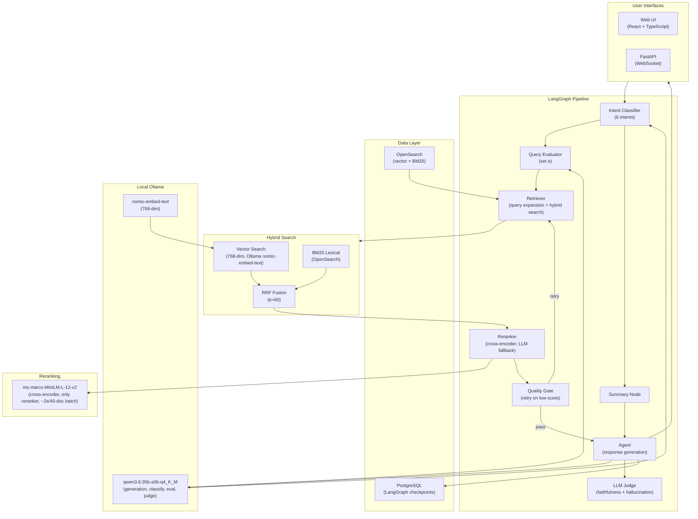

# Agentic Hybrid Search

> Other docs: [langchain_agent/README.md](langchain_agent/README.md) ·
> [tests/README.md](langchain_agent/tests/README.md) ·
> [tests/e2e/README.md](langchain_agent/tests/e2e/README.md)

A production-grade **LangGraph RAG agent** for Amazon ESCI e-commerce product search.
Combines hybrid retrieval (vector + BM25 via RRF), cross-encoder reranking, intent
routing, and real-time WebSocket streaming. Runs **local-only** (Docker
Compose) with a local Ollama LLM and embeddings — no cloud API key required —
see issue #110/#113 for why the earlier GCP Cloud Run deploy path was removed.

## Local Development With Docker

Runs PostgreSQL and OpenSearch in Docker, the FastAPI backend on
`localhost:8000`, and the Vite frontend on `localhost:5173`.

### Prerequisites

- [Ollama](https://ollama.com/) installed and running locally (`setup.sh`
  checks and pulls the required models)
- Docker Desktop
- Python 3.14+
- Node.js 24+

Java 21+ and Maven are only needed if you opt out of the default
Docker-based Lucille ETL ingest (`LUCILLE_USE_DOCKER=false`).

### Setup

```bash
cd langchain_agent
cp .env.example .env
./scripts/setup.sh    # One-time setup: pulls Ollama models (~23 GB), then ~35-40 min of Lucille embedding
./scripts/start.sh    # Start backend + frontend → http://localhost:5173
```

There is no login gate — the UI opens straight to the chat. The backend
runs on `http://localhost:8000`; the Vite frontend runs on
`http://localhost:5173`.

Useful follow-up commands:

```bash
./scripts/stop.sh         # Stop backend/frontend and Docker services
./scripts/teardown.sh     # Remove services, volumes, .venv, node_modules, logs
```

## What It Does

A conversational RAG agent powered by a local Ollama LLM for e-commerce product discovery:

- **6-intent classifier** — `search`, `comparison`, `attribute_filter`,
  `refinement`, `follow_up`, `summary` — single structured-output LLM call
  (no keyword fast-path)
- **Hybrid search** — vector (768-dim `nomic-embed-text` embeddings via
  Ollama) + BM25 lexical, fused via Reciprocal Rank Fusion (k=60)
- **Cross-encoder reranking** — local `ms-marco-MiniLM-L-12-v2` scores
  query-product relevance, no API call; it is the only reranker
- **Dynamic alpha** — query-aware lexical/semantic balance; fast-path alpha
  for comparison/attribute_filter/refinement, LLM path for search/follow_up
- **Quality gate** — if max reranker score is below the intent-specific threshold (comparison=0.55, search/follow_up=0.50, attribute_filter/refinement=0.45), adjusts alpha ±0.3, widens the candidate pool 4x, and retries once (fabrication/cross-product-bleed triggers auto-correction ~30s; inference/overreach surface only)
- **Conversational query rewriting** — resolves pronouns, comparatives, and
  short attribute questions using conversation history
- **Refinement with context validation** — "make them waterproof" narrows
  the prior result set; category/document-overlap scoring resets context
  when the user pivots
- **Typeahead autocomplete** — `GET /api/suggest` edge-ngram prefix matching
  on product titles + brands with spell correction (Levenshtein +
  SequenceMatcher), fuzzy fallback for single-character typos, and a
  three-section UI (Did you mean? / Suggestions / Recent Searches)
- **Admin diagnostics** — `GET /api/admin/health` reports index health and
  doc count; `GET /api/admin/diagnose` probes field-level hit counts.
  Same-origin checking is the only auth layer (no login gate). Routine
  full re-indexing is triggered via `scripts/lucille_ingest.sh`;
  `POST /api/admin/enrich` also triggers a real reindex directly, as part
  of the taxonomy growth & correction mechanism below;
  `POST /api/admin/demo-reset` re-arms the taxonomy demo by restoring the
  tan→yellow mis-tag defect so it can be demonstrated again
- **Agentic taxonomy growth & correction** — the agent can grow *or fix*
  its own catalog taxonomy via `trigger_enrichment`, gated by
  `ENABLE_ENRICHMENT_TOOL`: a genuine new color/waterproof term gets added,
  and a term already mapped to the *wrong* bucket can be corrected when a
  shopper disputes it (e.g. the shipped taxonomy maps "tan" to "yellow"
  instead of "brown"), invisible to automated quality gates since the wrong
  result still scores above threshold. By default (`REINDEX_TRIGGER=scoped`)
  this re-detects the attribute only on products whose text mentions the
  changed variant and bulk-updates just those (well under a second to a few
  seconds, no re-embedding); a full Lucille reindex remains available via
  `REINDEX_TRIGGER=local` but takes 30+ minutes — see
  `langchain_agent/ARCHITECTURE.md` and `langchain_agent/DEMO.md`
- **BM25 lexical optimizations** — synonym expansion, fuzzy matching, phrase
  boosting, and field boosting, displayed in the observability panel's
  "Search Optimizations" card
- **Pipeline Quality Summary** — every turn ends with a per-stage scorecard.
  With ESCI ground truth: NDCG@10 / MRR / Recall@20 / Precision@10 across
  BM25 → Hybrid → Reranked, plus a latency cost-benefit table. Without
  ground truth: a self-referential confidence proxy (top-1 score, score gap,
  variance, rank churn) labeled high/medium/low
- **Observability persistence** — clicking a past conversation hydrates the
  observability panel with that turn's last recorded state (intent, alpha,
  reranker score, quality gate verdict, latency breakdown) from the
  LangGraph checkpoint
- **Real-time streaming** — token-by-token WebSocket output with cancellation
- **Observability panel** — live visualization of every pipeline stage

## Architecture

### System Overview



### Pipeline Flow (RAG Q&A Mode)

```text
intent_classifier
  ├── search / comparison / attribute_filter /
  │   refinement / follow_up  → query_evaluator → retriever → reranker → quality_gate → agent → llm_judge
  │                                                                          │
  │                                                                          └── (retry) → retriever
  ├── summary                  → summary → agent → llm_judge
  └── clarify (low confidence) → agent → llm_judge (asks user to disambiguate)
```

Key decision points:

- **Query Evaluator** — classifies query type and sets optimal α (0.0–1.0)
  with an e-commerce-tuned guide.
- **Retriever** — resolves vague queries (pronouns, comparatives, short
  attribute questions) against conversation history before executing search,
  then runs hybrid retrieval.
- **Quality Gate** — if `reranker_max_score` is below the intent-specific
  threshold (comparison=0.55, search/follow_up=0.50, attribute_filter/refinement=0.45)
  and not yet retried, adjusts α ±0.3, widens the candidate pool 4x, and
  loops back to the retriever; otherwise continues to the agent.
- **Reranker** — cross-encoder scoring of top-K documents on a 0.0–1.0
  scale; the only reranker (no LLM fallback).
- **Citations** — Amazon search URLs derived from product title
  (`https://www.amazon.com/s?k={title}`), deduplicated and filtered by a
  minimum reranker score (0.10). Search-by-title is robust against delisted
  ASINs (the legacy `/dp/{ASIN}` form 404'd frequently).

### Search Balance (Alpha Parameter)

| α Range | Strategy | Best For |
| --- | --- | --- |
| 0.0–0.15 | Pure lexical | Exact model numbers, ASINs, UPCs |
| 0.15–0.40 | Lexical-heavy | Brand + category, specific attributes (color/size) |
| 0.40–0.60 | Balanced | Feature combinations, activity-based queries |
| 0.60–0.75 | Semantic-heavy | Conceptual needs, occasion-based queries |
| 0.75–1.0 | Pure semantic | Gift ideas, mood/style, open-ended exploration |

Fast-path defaults:

| Intent | α | Path |
| --- | --- | --- |
| `comparison` | 0.60 | Fast (keyword) |
| `attribute_filter` | 0.25 | Fast (keyword) |
| `refinement` | 0.35 | Fast (keyword) |
| `search`, `follow_up` | LLM-assigned | LLM path |

If the top reranker score is still below the intent-specific threshold
(comparison=0.55, search/follow_up=0.50, attribute_filter/refinement=0.45)
after retrieval, the Quality Gate retries with an opposite-direction α
adjustment.

## Tech Stack

| Category | Technology | Purpose |
| --- | --- | --- |
| **LLM (all chat calls)** | `qwen3.6:35b-a3b-q4_K_M` via local Ollama | Generation, intent classification, query evaluation, LLM judge, enrichment value judge |
| **Document Reranking** | `ms-marco-MiniLM-L-12-v2` (cross-encoder) | Only reranker (~2s for a 40-doc batch, measured in production) |
| **Embeddings** | `nomic-embed-text` via local Ollama | 768-dim vectors |
| **Vector Database** | OpenSearch 3.8.0 | HNSW `knn_vector` + BM25 |
| **Search Fusion** | Reciprocal Rank Fusion (k=60) | Hybrid score fusion |
| **Checkpoints** | PostgreSQL 18 (local dev via `pgvector/pgvector:0.8.6-pg18`) | LangGraph state persistence |
| **Agent Framework** | LangGraph + LangChain | Graph-based pipeline with typed state |
| **Backend API** | FastAPI + WebSocket | REST/WebSocket with real-time streaming |
| **Frontend** | React 19 + TypeScript + Tailwind + Zustand | Observability panel + chat UI |
| **Data** | Amazon ESCI (Shopping Queries Dataset) | 158,637 judged products |
| **Deployment** | Local only (Docker Compose) | Conference demo |

## The Four Demos

The app is projector-first and presenter-driven: pick a demo from the header
dropdown and step through it with the **Next** button (turn-progress pips,
a **Restart** button, a Details/Narration toggle on **F2**, plus Guide and
API-reference links round out the header). The chat box still accepts free
text if you want to go off-script, but nothing in the UI expects a query
typed from scratch — the four demos in
[`web/src/demos/registry.ts`](langchain_agent/web/src/demos/registry.ts)
are the guided path. Full presenter script:
[`langchain_agent/DEMO.md`](langchain_agent/DEMO.md) and the in-app `/guide`
page.

**Adaptive Query Enhancements** — one conversation, three turns that narrow
the way a real shopper actually shops: "Show me blue running shoes" →
"only size 10" → "what about trail running?". Watch α move 0.25 → 0.35 →
0.55 as the questions get less literal: turn 2 narrows within the prior
turn's pinned results, and turn 3 gets rewritten into a full query that
carries both earlier constraints forward into a fresh, more semantic
search. (This catalog has no price field, so every turn stays on
attributes that exist — color, size, brand, feature, waterproofing.)

**Proving It With Real Judgments** — a standalone turn ("sewing machine")
that happens to hit real Amazon ESCI ground truth, so the Pipeline Quality
Summary switches from the self-referential confidence proxy to genuine
graded NDCG@10 / MRR / Recall@20 / Precision@10 per stage.

**Classification & Ingestion** — the centerpiece. The shipped catalog
mis-tags "tan" as "yellow"; a shopper disputes it in chat; the agent
corrects the taxonomy via a scoped re-detection — re-checking only the
products that mention the disputed variant (905 products re-checked,
679 re-tagged, in under a second, measured live) — with no full reindex
and no re-embedding. Re-searching in a new conversation proves the fix
stuck. This demo consumes its own bug to demonstrate the fix, so the UI
re-arms it automatically each time it's selected
(`POST /api/admin/demo-reset` does the same thing manually).

**Data Enrichment: Schema Evolution** — the same machinery's other shape:
not correcting a wrong tag, but growing a filter dimension that never
existed. "Show me waterproof boots" returns nothing, because
`product_waterproof_primary` genuinely isn't populated yet — the
`waterproof` taxonomy ships with zero seed variants on purpose, so the gap
is real and reproducible rather than staged. The agent notices and calls
its enrichment tool *unprompted* (no shopper has to dispute anything,
unlike the demo above), reindexes, and the same query in a fresh
conversation comes back filtered. Also self-re-arming.

## Observability Panel

The web UI streams typed Pydantic events over WebSocket for every stage:

- **Intent Classification** — detected intent, confidence, keyword vs LLM path
- **Query Evaluation** — assigned α, reasoning, query expansion
  (pronouns/comparatives resolved)
- **OpenSearch Query** — α, intent, applied filters, plus a small "DSL"
  eye-icon that opens a modal with the exact query body the retriever
  sent (hybrid, BM25 baseline, and quality-gate retry are each shown
  separately; embedding vectors are scrubbed for readability)
- **Hybrid Search** — vector + BM25 candidates with scores
- **Reranker** — per-document 0.0–1.0 relevance and top-K selection
- **Quality Gate** — pass / retry / α adjusted
- **LLM Streaming** — token-by-token output with timing
- **Pipeline Quality Summary** — emitted after `AgentCompleteEvent`; renders
  the per-stage scorecard described below

Event schemas live in `langchain_agent/api/schemas/events.py` and must stay
in sync with `langchain_agent/web/src/types/events.ts`.

### Pipeline Quality Summary

The retriever runs hybrid + BM25-only in parallel (a 2-worker
`ThreadPoolExecutor` — opensearch-py releases the GIL during HTTP I/O), so
every turn produces a BM25 baseline ranking, the pre-rerank hybrid
ranking, the post-rerank ranking, and per-stage latencies (`bm25_ms`,
`retriever_ms`, `reranker_ms`).

When ESCI ground truth exists for the query (best-effort lookup against
the `esci_judgments` index — labels mapped E=4.0, S=1.0, C=0.1, I=0.0),
the summary card shows real metrics per stage: **NDCG@10**, **MRR**,
**Recall@20**, **Precision@10**, plus a latency cost-benefit table with a
"Lift / 100ms" column.

When there is no ground truth, the card falls back to a self-referential
**confidence proxy** — top-1 reranker score, score gap (top-1 vs top-2),
score variance, and rank-churn count between hybrid and reranked — bucketed
into `high` / `medium` / `low`.

Pure-Python metric implementations live in
[`langchain_agent/observability/relevancy_metrics.py`](langchain_agent/observability/relevancy_metrics.py)
(no NumPy). Event payload is `PipelineSummaryEvent` in
`api/schemas/events.py`; the UI lives in
`web/src/components/ObservabilityPanel/PipelineSummaryCard.tsx`.

## Key Techniques

| Technique | Description |
| --- | --- |
| **6-intent classification** | Single structured-output LLM call (no keyword fast-path) for `search`, `comparison`, `attribute_filter`, `refinement`, `follow_up`, `summary` |
| **Conversational query rewriting** | Resolves pronouns, comparatives, short attribute questions using conversation context; skips expansion when a specific brand/product is named |
| **Context-validated refinement** | Continuity scoring (category match + doc-ID overlap) distinguishes "make them waterproof" (refine prior boots) from "find me dresses" (reset) |
| **Dynamic α** | Fast-path α for comparison/attribute_filter/refinement; LLM path for search/follow_up |
| **RRF fusion** | `score = Σ 1/(rank + 60)` combining vector and BM25 rankings |
| **Quality gate with α adjustment** | Retries once with α ±0.3 and a 4x wider candidate pool if max reranker score is below the intent-specific threshold (comparison=0.55, search/follow_up=0.50, attribute_filter/refinement=0.45) |
| **Embedding cache** | Query embedding cache (60-min TTL) reduces API calls |
| **Deterministic sampling** | ESCI products sampled with `random_state=42` for reproducibility |
| **Idempotent ingestion** | Cached sample parquets (`esci_products_sample_{N}.parquet`) reused on re-runs |
| **Streaming responses** | WebSocket token-by-token generation with cancellation |
| **Link verification** | URLs validated before inclusion in responses; thread-safe 60-min TTL cache |

## Directory Structure

```text
opensearch2026-agentic-search/
├── README.md                     # This file
├── docker-compose.yml            # PostgreSQL + OpenSearch (local dev)
├── LICENSE
├── data/                         # Precomputed ESCI parquets (see data/README.md)
│   ├── esci_products.parquet
│   └── esci_judgments_aggregated.parquet
├── docs/                         # Docs for API consumers and contributors
│   ├── integration/              # REST/WebSocket examples, auth patterns
│   ├── contributing/             # Code patterns, testing, PR process
│   └── presentation/             # Conference talk materials
├── langchain_agent/              # Main application (see langchain_agent/README.md)
│   ├── main.py                   # EcommerceSearchAgent: setup, graph wiring, lifecycle (~600 lines)
│   ├── cli.py                    # Interactive terminal REPL (dev only)
│   ├── setup.py                  # DB + index init; invoked by scripts/setup.sh
│   ├── config_generator.py       # Regenerates the Lucille products.conf from OpenSearch
│   ├── core/                     # agent_state (CustomAgentState), config, exceptions, logging_config
│   ├── pipeline/                 # pipeline_nodes (the 8 LangGraph nodes), conversation_management, reindex_trigger
│   ├── retrieval/                # vector_store (RRF fusion), reranker, attribute_*, link_verifier, doc_replacer
│   ├── quality/                  # judge (LLM Judge), enrichment_service, enrichment_value_judge
│   ├── observability/            # relevancy_metrics, embedding_cache, llm_content
│   ├── checkpoints/              # checkpoint_maintenance (GC), checkpoint_optimizer
│   ├── benchmarks/               # benchmark_esci (relevancy), benchmark_search (latency)
│   ├── tools/                    # enrichment_tool (agent-facing taxonomy growth/correction tool)
│   ├── api/                      # FastAPI backend — see api/README.md
│   ├── web/                      # React frontend — see web/README.md
│   ├── scripts/                  # Lifecycle scripts — see scripts/README.md
│   ├── lucille-esci/             # Lucille ETL config — see lucille-esci/README.md
│   ├── tests/                    # unit, integration, e2e suites
│   └── Dockerfile                # Multi-stage build (Node + Python)
└── esci/                         # Amazon ESCI dataset (created by setup; gitignored)
```

## Documentation Map

| Location | Purpose | Audience |
|----------|---------|----------|
| [README.md](README.md) (this file) | Architecture, local setup, tech stack | Everyone |
| **For Developers** | | |
| [langchain_agent/README.md](langchain_agent/README.md) | Day-to-day development, API usage, config, troubleshooting | Backend/Frontend devs |
| [langchain_agent/ARCHITECTURE.md](langchain_agent/ARCHITECTURE.md) | Deep pipeline reference — every node, state, index design, attribute detection, taxonomy growth & correction mechanism | Backend devs |
| [langchain_agent/DEMO.md](langchain_agent/DEMO.md) | Live conference demo walkthrough, including the taxonomy self-correction centerpiece | Presenters |
| [langchain_agent/api/README.md](langchain_agent/api/README.md) | FastAPI backend layers (routes, middleware, schemas, services) | Backend devs |
| [langchain_agent/scripts/README.md](langchain_agent/scripts/README.md) | Lifecycle scripts (setup, dev, CI hooks) | All devs |
| [langchain_agent/web/README.md](langchain_agent/web/README.md) | React frontend (components, stores, hooks, testing) | Frontend devs |
| [langchain_agent/lucille-esci/README.md](langchain_agent/lucille-esci/README.md) | Lucille ETL config for ESCI ingest | Data/DevOps engineers |
| [langchain_agent/tests/README.md](langchain_agent/tests/README.md) | Test suite overview (unit, integration, e2e) | Test developers |
| [langchain_agent/tests/integration/README.md](langchain_agent/tests/integration/README.md) | Integration tests (multi-component, live services) | Backend/test devs |
| [langchain_agent/tests/e2e/README.md](langchain_agent/tests/e2e/README.md) | End-to-end tests (local backend by default) | QA/test devs |
| [data/README.md](data/README.md) | Precomputed ESCI parquets (products, judgments) | Data engineers |
| **For API Consumers** | | |
| [docs/integration/README.md](docs/integration/README.md) | REST/WebSocket examples, auth patterns | Integrators |
| **For Contributors** | | |
| [docs/contributing/README.md](docs/contributing/README.md) | Code patterns, testing, PR process | Contributors |
| **For Claude Code sessions** | | |
| [CLAUDE.md](CLAUDE.md) | Project guidance, GitHub Issues workflow, common commands, patterns, env vars — loaded automatically by Claude Code | AI/dev assistant |

## Search Optimization

- **Vector search** — 768-dim `nomic-embed-text` (Ollama) via HNSW (~200–500 ms)
- **Lexical search** — BM25 via OpenSearch's Lucene analyzer (~100–300 ms)
- **RRF fusion** — `score = Σ 1/(rank + 60)` normalizes across methods
- **Dynamic α** — set per-query by the Query Evaluator
- **Quality Gate** — automatic α ±0.3 retry with a 4x wider candidate pool when max reranker score is below the intent-specific threshold (comparison=0.55, search/follow_up=0.50, attribute_filter/refinement=0.45)

### Key Tunables

**Note:** Most retriever and reranker knobs are hardcoded in `langchain_agent/core/config.py` and cannot be changed via `.env` — setting them there has no effect. To modify them, edit `core/config.py` directly and restart the backend.

```python
# langchain_agent/core/config.py
RETRIEVER_K = 10                 # Final documents returned
RETRIEVER_FETCH_K = 40           # Candidates fetched before reranking
RETRIEVER_ALPHA = 0.25           # Default lexical/semantic balance
                                  # (query evaluator usually overrides per-query)
RERANKER_FETCH_K = 40            # Candidates reranked
RERANKER_TOP_K = 10              # Final top-K after reranking
ENABLE_RERANKING = True
ENABLE_QUERY_EVALUATION = True
```

Environment variables (in `.env`) that **do** affect behavior include `ESCI_INGEST_LIMIT`, `QUALITY_GATE_THRESHOLD`, and the model selections (`LLM_MODEL`, `EMBEDDINGS_MODEL`, `QUERY_EVAL_MODEL`, `JUDGE_MODEL`, `OLLAMA_HOST`, `OLLAMA_KEEP_ALIVE`, `OLLAMA_NUM_CTX`) — see `langchain_agent/.env.example` for the full, current list with defaults. That file is the single source of truth for what's genuinely configurable; this README doesn't duplicate it in full to avoid drifting out of sync again.

## Operations

Local development is fully driven by scripts in `langchain_agent/scripts/`:

```bash
cd langchain_agent
cp .env.example .env
./scripts/setup.sh          # Docker + venv + DB + Ollama models + product ingestion
./scripts/start.sh          # Backend :8000 + frontend :5173
./scripts/stop.sh           # Stop local services
./scripts/teardown.sh       # Full cleanup
```

**Prerequisites:** Docker Desktop, Python 3.14+, Node.js 24+, [Ollama](https://ollama.com/)
installed and running (`setup.sh` pulls the required models, ~23 GB), and
disk for the ESCI dataset plus Docker volumes. (Java 21+/Maven only needed
for `LUCILLE_USE_DOCKER=false`.)

There is no CI/CD pipeline and no deploy step (issue #110/#113) — `make check`
run locally is the only gate before merging to `main`.

### ESCI data ships in `data/`

`data/esci_products.parquet` (158,637 products, text only — embeddings are
generated at ingest time by Lucille via Ollama) and
`data/esci_judgments_aggregated.parquet` are committed to the repo and read
directly by `scripts/lucille_ingest.sh`. The Docker image does not bundle
these — ingest runs from a workstation, not inside the container.

## Performance

| Operation | Time |
| --- | --- |
| Vector search (HNSW, 768-dim) | ~200–500 ms |
| BM25 lexical search | ~100–300 ms |
| RRF fusion + reranking | ~1–2 s |
| Query embedding (cached / fresh) | ~50 ms / ~500 ms |
| Query evaluation (α + expansion) | ~300–500 ms |
| LLM response generation (streaming) | ~3–8 s |
| Quality Gate retry (if triggered) | +1–2 s |
| **End-to-end product search** | **~6–15 s** |

Cached queries (within the 60-minute window) shave ~2–3 s off the total.

---

**Status:** Local-only conference demo (issue #110/#113).
