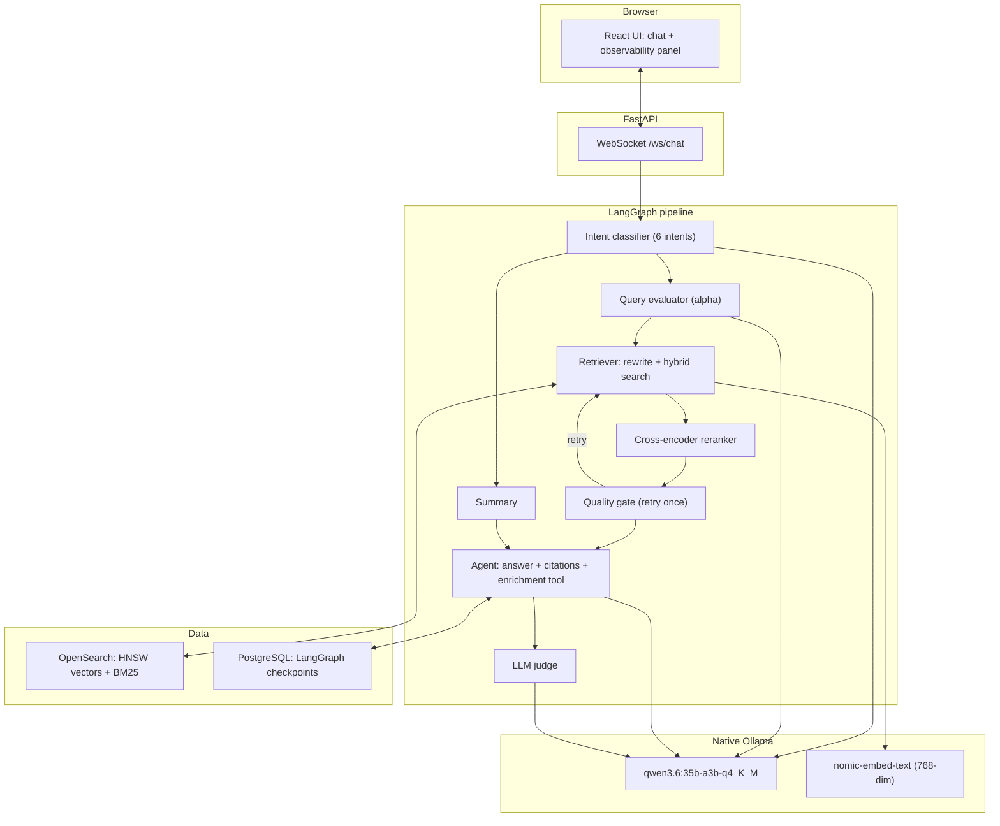

# Agentic Hybrid Search

A LangGraph RAG agent for e-commerce product search over the Amazon ESCI
corpus. It fuses vector and BM25 retrieval with Reciprocal Rank Fusion, picks
the lexical/semantic balance per query, reranks with a local cross-encoder
behind a quality gate, streams every pipeline stage to a React observability
panel over WebSocket, and can grow or correct its own catalog taxonomy from a
conversation. Everything runs on one machine: Docker Compose for PostgreSQL and
OpenSearch, native [Ollama](https://ollama.com/) for every model. No cloud API,
no key.

## The demo

The app is presenter-driven: pick one of three scripted demos from the header
and step through it with **Next**. The scripts live in
[`langchain_agent/web/src/demos/registry.ts`](langchain_agent/web/src/demos/registry.ts);
the presenter runbook is [`langchain_agent/DEMO.md`](langchain_agent/DEMO.md).

| Demo | What it shows |
| --- | --- |
| Adaptive Query Enhancements | One conversation, three narrowing turns; alpha moves 0.25 -> 0.35 -> 0.70 as the questions get less literal, and the rewriter carries earlier constraints into the last one. |
| Classification & Correction | The catalog mis-tags "tan" as "yellow" and the result *passes* the quality gate; a shopper disputes it and the agent re-tags only the affected products, live, in under a second. |
| Data Enrichment: Schema Evolution | "waterproof boots" returns nothing because that dimension does not exist yet; the agent notices, teaches the catalog the term, and the same query comes back filtered. |

## Quickstart

Prerequisites: Docker Desktop, Python 3.14+, Node.js 24+, Git LFS
(`git lfs install`), and Ollama running.

```bash
cd langchain_agent
make setup     # .venv, npm install, Docker services, Ollama models (~23 GB once),
               # then a ~1-2 min bulk load of the committed corpus export
make dev       # everything, side by side (see below)
```

`make dev` starts:

| | URL | Notes |
| --- | --- | --- |
| Dev UI | http://localhost:5173 | Vite, live reload; proxies `/api` and `/ws` to the native backend |
| Dev backend | http://localhost:8080 | `uvicorn --reload`; `/swagger` for the API reference |
| Demo | http://localhost:8000 | Backend + built UI in one container, rebuilt from the tree on every `make dev` |

`./scripts/stop.sh` stops all of it (data survives); `make teardown` wipes
`.venv`, `node_modules`, and the Docker volumes; `make doctor` checks
prerequisites. The Makefile has exactly five targets: `doctor setup dev ci
teardown`.

There is no CI service and no deploy: `make ci`, run locally, is the only
gate — format, lint, types, unit tests, frontend tests and build, then live
integration tests and a WebSocket smoke round-trip against the dev backend.
Run it before every push to `main`.

## How it works


```mermaid
flowchart TB
    subgraph UI["Browser"]
        WEB["React UI: chat + observability panel"]
    end
    subgraph API["FastAPI"]
        WS["WebSocket /ws/chat"]
    end
    subgraph Pipeline["LangGraph pipeline"]
        IC["Intent classifier (6 intents)"]
        QE["Query evaluator (alpha)"]
        RET["Retriever: rewrite + hybrid search"]
        RERANK["Cross-encoder reranker"]
        QG["Quality gate (retry once)"]
        SUM["Summary"]
        AGENT["Agent: answer + citations + enrichment tool"]
        JUDGE["LLM judge"]
    end
    subgraph Data["Data"]
        OS["OpenSearch: HNSW vectors + BM25"]
        PG["PostgreSQL: LangGraph checkpoints"]
    end
    subgraph Ollama["Native Ollama"]
        LLM["qwen3.6:35b-a3b-q4_K_M"]
        EMB["nomic-embed-text (768-dim)"]
    end
    WEB <--> WS --> IC
    IC --> QE --> RET --> RERANK --> QG --> AGENT --> JUDGE
    IC --> SUM --> AGENT
    QG -->|retry| RET
    RET <--> OS
    RET --> EMB
    AGENT <--> PG
    IC & QE & AGENT & JUDGE --> LLM
```

- **Intent** — one structured-output LLM call picks `search`, `comparison`,
  `attribute_filter`, `refinement`, `follow_up`, or `summary`; confidence under
  0.7 asks a clarifying question instead of searching.
- **Alpha** — the lexical/semantic weight (0 = pure BM25, 1 = pure vector).
  Fast-path defaults for `comparison` (0.60), `attribute_filter` (0.25), and
  `refinement` (0.35); the LLM assigns it for `search` and `follow_up`.
- **Retrieval** — the retriever rewrites vague follow-ups against the
  conversation ("what about trail running?" becomes a full query), extracts
  color / waterproof / brand / feature filters, and runs vector + BM25 in
  parallel, fused with RRF (k=60). A BM25-only baseline runs alongside so every
  turn can be scored stage by stage.
- **Reranker + quality gate** — a local `ms-marco-MiniLM-L-12-v2`
  cross-encoder scores the candidates. If the best score is under the intent's
  threshold (comparison 0.55, search/follow_up 0.50, attribute_filter/refinement
  0.45) the gate retries once with alpha shifted by 0.3 and a 4x wider pool.
- **Agent + judge** — the answer streams token by token with Amazon
  search-by-title citations and inline product photos; a second LLM pass flags
  fabrications and regenerates once if it finds one.
- **Taxonomy growth and correction** — color and waterproof are hard filters
  backed by a taxonomy stored in OpenSearch. When a filter term is unknown, or a
  shopper disputes a tag, the agent can call `trigger_enrichment` (gated by
  `ENABLE_ENRICHMENT_TOOL`, on in this repo's `.env`) to write the mapping and
  re-tag only the products whose text mentions the term. There is no full
  reindex; the corpus itself is a frozen export.

Deeper: [`langchain_agent/ARCHITECTURE.md`](langchain_agent/ARCHITECTURE.md).

## Stack

| Layer | Technology |
| --- | --- |
| LLM (all calls) | `qwen3.6:35b-a3b-q4_K_M` via Ollama |
| Embeddings | `nomic-embed-text` via Ollama, 768-dim |
| Reranker | `cross-encoder/ms-marco-MiniLM-L-12-v2`, local |
| Search | OpenSearch 3.8 — HNSW `knn_vector` + BM25, RRF fusion |
| Checkpoints | PostgreSQL 18 (LangGraph) |
| Agent | LangGraph + LangChain |
| API | FastAPI, WebSocket streaming |
| Frontend | React 19, TypeScript, Vite, Tailwind, Zustand |
| Data | ESCI US `test` + `small_version` products: 158,637 products, 95.5% with a product image |

## Repository

```text
langchain_agent/        the application (Makefile lives here)
  main.py               EcommerceSearchAgent: graph wiring and lifecycle
  setup.py              database + index init, invoked by scripts/setup.sh
  core/                 agent state, config, exceptions, logging
  pipeline/             the LangGraph nodes, conversation management, scoped re-tag
  retrieval/            vector store (RRF), reranker, embeddings, attribute taxonomy
  quality/              LLM judge, enrichment service and value judge, demo reset
  observability/        confidence proxy, embedding cache
  checkpoints/          checkpoint optimizer
  tools/                the agent's enrichment tool
  api/                  FastAPI app: routes, schemas, services, middleware
  web/                  React frontend
  scripts/              setup / start / stop / teardown / doctor / smoke
  tests/                unit, integration, e2e
data/precomputed/       the corpus export (Git LFS) — the only data
docker-compose.yml      postgres, opensearch, and the demo `app` container
```

## Documentation

| Doc | Covers |
| --- | --- |
| [langchain_agent/README.md](langchain_agent/README.md) | Day-to-day development, configuration, troubleshooting |
| [langchain_agent/ARCHITECTURE.md](langchain_agent/ARCHITECTURE.md) | Every node, state, events, index design, taxonomy mechanism |
| [langchain_agent/DEMO.md](langchain_agent/DEMO.md) | Presenter runbook |
| [langchain_agent/api/README.md](langchain_agent/api/README.md) | REST and WebSocket contract |
| [langchain_agent/web/README.md](langchain_agent/web/README.md) | Frontend |
| [langchain_agent/scripts/README.md](langchain_agent/scripts/README.md) | Lifecycle scripts |
| [langchain_agent/tests/README.md](langchain_agent/tests/README.md) | Test suites |
| [data/README.md](data/README.md) | The corpus export and its provenance |
| [CLAUDE.md](CLAUDE.md) | Guidance for Claude Code sessions |

License: see [LICENSE](LICENSE).
